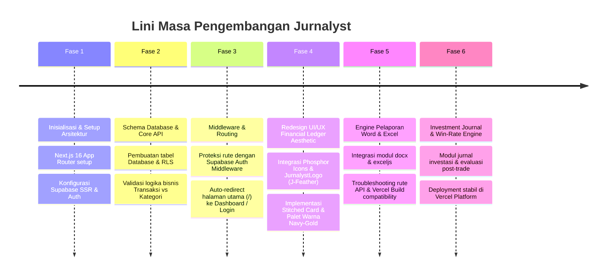

# 📘 LAPORAN PENGEMBANGAN SISTEM: JURNALYST
**Dokumentasi Komprehensif Perjalanan Pengembangan Aplikasi Dari Awal Hingga Saat Ini**

---

## DAFTAR ISI

- Halaman Sampul
- Kata Pengantar
- Ucapan Terima Kasih
- Lembar Pengesahan

**Bab 1: Pendahuluan**
- 1.1 Latar Belakang & Tujuan Aplikasi
- 1.2 Target Pengguna (User Roles)
- 1.3 Kebutuhan Sistem (Minimum Hardware & Software Requirement)

**Bab 2: Arsitektur & Perancangan Sistem**
- 2.1 Alur Kerja Sistem (*Business Process*)
- 2.2 Teknologi (Bahasa Pemrograman, *Framework*, *Database*)
- 2.3 Perancangan Basis Data (ERD / Struktur Tabel)

**Bab 3: Memulai Aplikasi**
- 3.1 Cara Akses atau Instalasi (Web/Desktop/Mobile)
- 3.2 Halaman Utama & Tampilan Antarmuka (UI Overview)
- 3.3 Prosedur Registrasi & Pembuatan Akun Baru
- 3.4 Panduan Login dan Logout

**Bab 4: Manajemen Akun & Pengaturan (Settings)**
- 4.1 Mengubah Profil Pengguna & Kata Sandi
- 4.2 Pengaturan Hak Akses (Role Management)
- 4.3 Konfigurasi Umum Aplikasi

**Bab 5: Fitur Utama Aplikasi (Core Features)**
- 5.1 Modul Dashboard & Statistik
- 5.2 Modul Manajemen Data / Input Data
- 5.3 Modul Transaksi / Proses Utama
- 5.4 Modul Laporan & Ekspor Data

**Bab 6: Panduan Lanjutan (Advanced Features)**
- 6.1 Integrasi dengan Sistem Lain (jika ada)
- 6.2 Pencadangan & Pemulihan Data (Backup & Restore)

**Bab 7: Pemecahan Masalah (Troubleshooting)**
- Berisi: Kendala Umum dan Solusinya (Error Code, Lupa Password, Koneksi)

**Lampiran**

---

## 📌 1. Ringkasan Eksekutif & Tujuan Proyek

**Jurnalyst** adalah aplikasi *Financial Ledger*, *Asset Tracking*, *Investment Journal*, dan *Portfolio Management* modern berbasis web. Aplikasi ini dirancang untuk memberikan transparansi total, kedisiplinan pencatatan keuangan, serta analisis keputusan investasi berbasis data (*data-driven investment evaluation*).

### 🎯 Tujuan Utama
1. **Pencatatan Keuangan Terintegrasi**: Menggabungkan pencatatan transaksi harian (*Income & Expense*), kategori keuangan, akun likuiditas (bank, e-wallet, kas), serta aset fisik dan digital dalam satu platform.
2. **Jurnal Keputusan Investasi (*Investment Hypothesis*)**: Memfasilitasi pelacakan posisi saham/kripto/aset beserta hipotesis transaksi, target harga (*Target Price*), *Stop Loss*, evaluasi pasca-transaksi (*post-trade reflection*), dan perhitungan *Win Rate*.
3. **Pelaporan Otomatis (*Automated Reporting*)**: Menyediakan fitur ekspor laporan keuangan dan portofolio langsung ke format Microsoft Word (`.docx`) dan Excel (`.xlsx`).
4. **Desain Aesthetic Premium (*Financial Ledger Aesthetic*)**: Mengusung antarmuka eksklusif dengan tema *stitched card*, tipografi finansial yang bersih, ikonografi Phosphor, dan palet warna profesional (Navy, Amber, Slate).

---

## 🏗️ 2. Arsitektur & Teknologi (*Tech Stack*)

Proyek ini dibangun menggunakan teknologi *full-stack web* modern dengan standar industri terbaru:

| Komponen | Teknologi | Deskripsi / Peran |
| :--- | :--- | :--- |
| **Frontend Framework** | **Next.js 16 (App Router)** | Framework React modern untuk *Server-Side Rendering* (SSR), *Client Components*, dan rute API yang cepat. |
| **UI Library & React** | **React 19 & TypeScript 5** | Manajemen UI deklaratif dengan *type safety* ketat. |
| **Styling & Design System** | **Tailwind CSS v4 & Custom Tokens** | Desain kustom berbasis HSL (*Navy/Gold/Slate*), utilitas `clsx` & `tailwind-merge`. |
| **Iconography & Visual** | **Phosphor Icons (`@phosphor-icons/react`)** | Set ikon vektor modern untuk komponen navigasi, kartu, dan aksi UI. |
| **Brand Identity** | **Custom `JurnalystLogo` ("J-Feather")** | Logo kustom SVG yang merepresentasikan kombinasi pena bulu jurnal dan grafik keuangan. |
| **Backend & Database** | **Supabase (PostgreSQL & SSR Auth)** | Database relasional PostgreSQL, Row Level Security (RLS), dan autentikasi berbasis *cookies* (`@supabase/ssr`). |
| **Data Visualization** | **Recharts (`recharts`)** | Visualisasi grafis alokasi aset, tren arus kas, dan grafik performa investasi. |
| **Reporting Engine** | **`docx` & `exceljs` / `xlsx`** | Engine pencetak laporan otomatis ke format Word (`.docx`) dan spreadsheet Excel (`.xlsx`). |
| **Deployment & CI/CD** | **Vercel Platform** | Deployment otomatis berbasis Git commit dengan manajemen environment variables. |

---

## 💡 3. Fitur Utama & Modul Sistem

Sistem Jurnalyst terdiri dari modul-modul utama yang saling terintegrasi:

### 1. 📊 Dashboard Finansial (`/dashboard`)
* Overview Kekayaan Bersih (*Net Worth*) secara real-time.
* Visualisasi grafik alokasi aset dan ringkasan arus kas bulanan (*Income vs Expense*).
* Akses cepat ke transaksi terbaru dan aksi pelaporan.

### 2. 📖 Investment Journal (`/journal`)
* **Pencatatan Hipotesis**: Menyimpan alasan masuk posisi (analisis teknikal/fundamental, katalis pasar).
* **Manajemen Risk/Reward**: Setting *Target Price* (TP) dan *Stop Loss* (SL).
* **Perhitungan Win Rate**: Kalkulasi persentase kemenangan (*Win/Loss Ratio*) dari posisi yang diselesaikan.
* **Refleksi Post-Trade**: Tempat evaluasi emosi dan pelajaran dari setiap transaksi.

### 3. 💳 Transaksi & Arus Kas (`/transactions`)
* Pencatatan *Income* (pemasukan) dan *Expense* (pengeluaran).
* Validasi ketat hubungan tipe transaksi dengan kategori untuk mencegah salah input.
* Filter berdasarkan tanggal, jenis transaksi, dan pencarian instan.

### 4. 🏷️ Kategori Keuangan (`/categories`)
* Pengelolaan kategori khusus (*Custom Categories*) untuk fleksibilitas alokasi anggaran.

### 5. 🏦 Akun Likuiditas & Kas (`/accounts`)
* Pemantauan saldo di berbagai rekening bank, dompet digital, dan cadangan kas.

### 6. 🏢 Manajemen Aset (`/assets`)
* Pelacakan aset fisik (properti, kendaraan, peralatan) dan aset digital beserta estimasi nilai terkini.

### 7. 📈 Portofolio & Harga Real-Time (`/portfolio` & `/api/price`)
* Manajemen kepemilikan aset (*holdings*), harga beli rata-rata (*Average Buy Price*), dan simulasi *Gain/Loss*.
* API integrasi penarikan harga aset (*real-time price fetching*).

### 8. 📄 Machine Export Reports (`/api/reports/word` & `/api/reports/excel`)
* Generasi berkas `.docx` berisi ringkasan laporan keuangan dan portofolio berformat resmi.
* Generasi berkas `.xlsx` untuk analisis data angka secara mendalam di Excel.

---

## ⏱️ 4. Kronologi Pengembangan (*Development Timeline*)

Berikut adalah lini masa pengembangan aplikasi Jurnalyst dari commit awal hingga tahap terkini:

### Detail Tahapan Pengembangan:

#### 🔹 Fase 1: Inisialisasi Proyek & Pondasi Dasar (`Initial commit`)
* Inisialisasi repository Next.js 16 berbasis TypeScript dan Tailwind CSS.
* Pengaturan struktur folder App Router (`app/`, `components/`, `lib/`).
* Konfigurasi koneksi Supabase client & server helper (`lib/supabase/client.ts`, `lib/supabase/server.ts`).

#### 🔹 Fase 2: Pengembangan Logika Bisnis & API Routes
* Pembuatan rute API untuk pengelolaan CRUD:
  * `/api/transactions`
  * `/api/categories`
  * `/api/accounts`
  * `/api/assets`
  * `/api/portfolio-holdings`
  * `/api/journal-entries`
* Implementation validasi tipe transaksi vs kategori untuk menjamin integritas data pencatatan keuangan.

#### 🔹 Fase 3: Sistem Proteksi Rute & Navigasi
* Pembuatan `lib/middleware.ts` untuk menangani sesi autentikasi pengguna secara otomatis.
* Konfigurasi auto-redirection pada `app/page.tsx` sehingga pengguna yang belum login diarahkan ke `/login` dan yang sudah login langsung menuju `/dashboard`.

#### 🔹 Fase 4: Modernisasi Antarmuka & Rebranding UI/UX
* Transformasi visual menyeluruh menuju **Financial Ledger Aesthetic**:
  * Penggunaan font serif pada judul (*classic ledger feel*).
  * Efek visual *stitched cards* dan *subtle borders*.
  * Pembuatan logo kustom `JurnalystLogo` ("J-Feather") dan komponen `AppNavbar` yang responsif.
  * Integrasi library ikon `@phosphor-icons/react` menggantikan ikon generik.

#### 🔹 Fase 5: Modul Ekspor Laporan Dokumen (Word & Excel)
* Pembangunan backend endpoint `/api/reports/word` memanfaatkan modul `docx` untuk menyusun laporan profesional berformat Microsoft Word.
* Pembangunan endpoint `/api/reports/excel` berbasis `exceljs` / `xlsx` untuk pencetakan tabel data ke Excel.
* Perbaikan kompatibilitas tipe TypeScript (*symbol type definitions*) untuk menjamin kelancaran kompilasi build pada server Vercel.

#### 🔹 Fase 6: Investment Journal & Integrasi Performa Portofolio (Saat Ini)
* Peluncuran halaman `/journal` dengan fitur pelacakan hipotesis trading, target price, stop loss, dan refleksi pasca-posisi.
* Kalkulasi otomatis persentase *Win Rate* untuk melatih kedisiplinan psikologi investasi.
* Penstabilan koneksi API backend & perbaikan penanganan data null pada komponen UI.

---

## 📈 5. Status Terkini & Rencana Selanjutnya (*Current Status & Roadmap*)

### 📊 Status Terkini (Current Status)
* **Versi**: `0.1.0` (Production Ready)
* **Status Build**: Passing & Deployed di Vercel.
* **Autentikasi**: Aktif (Supabase SSR Cookies Auth).
* **Modul Berjalan**: Dashboard, Journal, Transactions, Categories, Accounts, Assets, Portfolio Holdings, Export Word/Excel.

### 🚀 Rencana Pengembangan Selanjutnya (Roadmap)
1. **Sync Harga Pasar Otomatis**: Integrasi API pihak ketiga (misal: Yahoo Finance / CoinGecko) untuk update harga saham & kripto secara real-time.
2. **Dukungan Multi-Mata Uang (Multi-Currency)**: Fitur konversi mata uang otomatis (IDR, USD, EUR, SGD).
3. **Ekspor PDF & Template Laporan Kustom**: Menambahkan opsi unduh laporan berformat `.pdf` berdesain resmi.
4. **Mobile App / PWA**: Optimization Progressive Web App agar dapat diinstal langsung di Smartphone.

---
*Laporan ini dibuat secara otomatis oleh Antigravity System pada 1 September 2026.*
